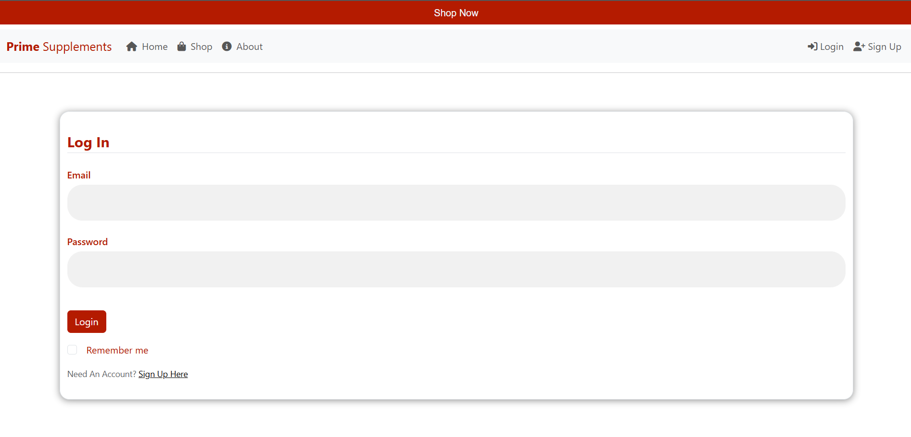
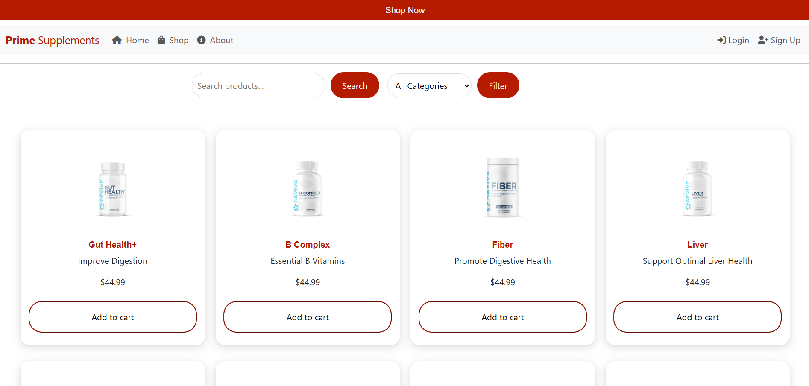
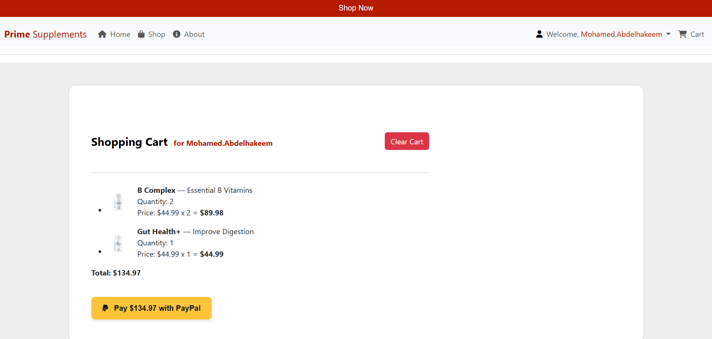

**Prime Supplements** is a full-stack e-commerce web application built with Flask using the **Blueprint design pattern** to ensure modular, scalable, and organized code structure. The platform allows users to browse health supplements, manage a shopping cart, register/login securely, and write reviews.

## 🧠 Features

- 🛒 Product browsing, searching, filtering by category
- 🧾 Shopping cart system (session-based for guests, user-based for logged-in users)
- 🔐 User registration, login, and session management using Flask-Login and bcrypt
- 🗣️ Authenticated users can add, edit, and delete their own product reviews
- 💬 Flash messaging for feedback on user actions
- 📦 Product data creation with category-based organization
- 📁 Modular architecture using Flask Blueprints

## 💡 Technologies Used

### Backend
- Python
- Flask
- Flask Blueprints (modular structure)
- Flask-Login
- Flask-Bcrypt
- Flask-WTF / WTForms
- Flask-SQLAlchemy
- SQLite (local development database)

### Frontend
- HTML
- CSS
- Bootstrap

### Deployment
- Docker
- Docker Hub

## 🚀 Getting Started

1. **Clone the repository**  
```bash
git clone https://github.com/Mohamed-Abdelhakeem-x/Supplements-Store.git
cd Supplements-Store
```

2. **Install dependencies**  
```bash
pip install -r requirements.txt
```

3. **Run the app**  
```bash
flask run
```

4. **Or run via Docker**  
```bash
docker pull mohamedabdelhakeem/prime-supplements
docker run -p 3000:3000 mohamedabdelhakeem/prime-supplements
```

## 📂 Project Structure

```
Prime_Supplements/
│
├── Main/           # Home, About, and Shop routes
├── users/          # Registration, login, logout
├── cart/           # Cart logic and cart pages
├── Review/         # User review system
├── models.py       # SQLAlchemy models
├── forms/          # WTForms for auth, cart, and reviews
├── templates/      # HTML pages
├── static/         # CSS, JS, Images
```

## 📸 Screenshots




## 🔗 Links

- 🐙 GitHub: [Supplements-Store](https://github.com/Mohamed-Abdelhakeem-x/Supplements-Store)
- 🐳 Docker Hub: [`mohamedabdelhakeem/prime-supplements`](https://hub.docker.com/r/mohamedabdelhakeem/prime-supplements)

## 👨‍💻 Author

**Mohamed Abdelhakeem**  
An aspiring Backend Engineer passionate about building modern, scalable web applications.

## 📝 License

This project is licensed under the [MIT License](LICENSE).
---

**Feel free to contribute and enhance the project! 🚀**
